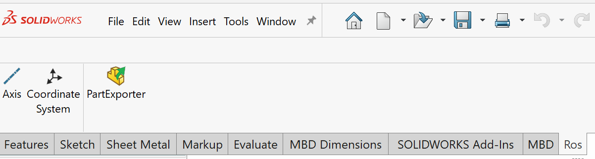

# SolidWorks to URDF Exporter

A forked version based on the [solidworks_urdf_exporter](https://github.com/ros/solidworks_urdf_exporter).

## Release

[Download installer](https://github.com/weianweigan/solidworks_urdf_exporter/releases)

## SolidWorks Version Requirements

1. SolidWorks 2018 SP5 and later recommanded.

## Usage

See the [ROS Wiki](http://wiki.ros.org/sw_urdf_exporter) and associated [tutorials](http://wiki.ros.org/sw_urdf_exporter/Tutorials).

